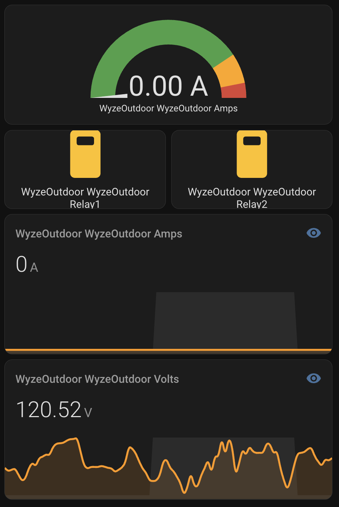

# Hacking Wyze Outdoor Plugs for ESPHome in the Greenhouse

One of the most satisfying parts of my greenhouse control system is taking cheap consumer hardware and turning it into something completely custom. The Wyze Outdoor Smart Plugs are a perfect example — nice weatherproof cases, dual controllable outlets, and power monitoring hardware inside. Unfortunately, out of the box, they’re locked to Wyze’s cloud. That doesn’t work for me.  

So, I cracked one open, soldered on some serial leads, and flashed it with **ESPHome**. I followed [this excellent guide on devices.esphome.io](https://devices.esphome.io/devices/wyze-outdoor-plug/) — highly recommended if you’re attempting the same. Just **make sure you’re not connected to mains power while you’re working on it** and that your USB-to-serial board is set to the correct voltage (3.3 V).  

I use two of these plugs now: one drives the **GAHT fan**, and the other runs a few **seedling heat mats** in early spring. They’re fully integrated into Home Assistant and report power, voltage, and light levels.  

Let’s walk through my ESPHome configuration and see what each part does.

---

## Why the Wyze Outdoor Plug is Perfect for This

There are a lot of smart plugs out there, but the Wyze Outdoor Plug checks all the boxes for greenhouse use:

- **Weather-resistant case:** It’s built to handle moisture, dirt, and the occasional splash — perfect for a greenhouse environment.  
- **15-amp rating:** Enough capacity to safely handle motors, fans, and heat mats.  
- **Power monitoring:** The internal HLW8012 chip provides real-time current, voltage, and wattage data.  
- **Two individually controlled outlets:** Lets me run two separate devices off a single Wi-Fi connection.  
- **Physical buttons:** Each outlet can be toggled directly — great for temporary devices like lights or power tools.  
- **ESP32-based hardware:** Easy to reflash, well-supported by ESPHome, and powerful enough to act as a Bluetooth proxy too.  

For the price, it’s a surprisingly capable little box once freed from the cloud.

---

## Basic Setup

```yaml
substitutions:
  display_name: WyzeOutdoor
  current_res: "0.001"
  voltage_div: "790"
```

Substitutions are just variables. They make it easy to reuse names or tweak calibration values later. Here, current_res and voltage_div are used to calibrate the power monitor readings from the HLW8012 chip inside the plug.

## Core Device Definition

```yaml
esphome:
  name: wyzeoutdoor
  friendly_name: ${display_name}

esp32:
  board: esp-wrover-kit
  framework: 
    type: esp-idf
```

This tells ESPHome what we’re flashing. The Wyze plug uses an ESP32, and the “esp-wrover-kit” profile matches its hardware. The ESP-IDF framework is a bit lower-level than Arduino, but it’s more stable for ESP32-based devices.

## Connectivity

```yaml
wifi:
  networks:
    - ssid: !secret wifi_ssid
      password: !secret wifi_password
captive_portal:
logger:
web_server:
  port: 80
api:
ota:
  - platform: esphome
```

All the usual suspects here: Wi-Fi setup, logging, and OTA (over-the-air) updates.

The OTA feature is one of the best parts of ESPHome — I can push updates directly from the ESPHome Builder dashboard in Home Assistant without ever opening the device again. Just hit “Install” and it flashes the new firmware wirelessly.

The built-in web_server is also a lifesaver when debugging. If something isn’t behaving right, I can connect straight to the device’s IP address and get a live view of its sensors, switches, and logs. It’s saved me more than once when tracking down flaky Wi-Fi or calibration issues.

## Relays and LEDs

Each outlet on the Wyze plug is tied to a GPIO pin that drives a relay, and each relay has an LED indicator:

```yaml
switch:
  - platform: gpio
    name: ${display_name} Relay1
    restore_mode: RESTORE_DEFAULT_ON
    pin:
      number: GPIO15
    on_turn_on:
    - light.turn_on: relay1_led
```

This defines the first relay (Relay1) — it defaults to on when the plug boots, which is controlled by the restore_mode setting.

That little line is more important than it looks. restore_mode: `RESTORE_DEFAULT_ON` means that if the device restarts (say, during an ESPHome update or power flicker), the relay will come back on automatically. I’ve had problems in the past where a restart would shut down a critical system — like the GAHT fan — so this makes sure that doesn’t happen again.

When the relay turns on, the matching LED also lights

The LEDs themselves are defined as binary lights driven by GPIO outputs:

```yaml
output:
  - platform: gpio
    pin: GPIO19
    inverted: True
    id: relay1_led_gpio
```

inverted: True means the LED turns on when the pin goes low — that’s just how the circuit is wired internally.

## Power Monitoring

The Wyze plug includes an HLW8012 chip, which measures current, voltage, and power draw. ESPHome has a native platform for this chip:

```yaml
sensor:
  - platform: hlw8012
    sel_pin:
      number: GPIO25
      inverted: true
    cf_pin: GPIO27
    cf1_pin: GPIO26
    current_resistor: ${current_res}
    voltage_divider: ${voltage_div}
```

Then we tell it how to scale readings with our earlier substitutions:

I did a quick calibration against a known 60 W bulb — that’s why there’s this adjustment:

```yaml
filters:
  - calibrate_linear:
      - 0.0 -> 0.0
      - 134 -> 58
```

That brings the readings in line with reality.

We use the amp draw readings to keep an eye on motors and make sure everything’s healthy. For example, if the GAHT fan suddenly draws more or less current than normal, it’s a sign something’s wrong — maybe a blockage or a loose wire. It’s also a quick way to verify that nothing has accidentally come unplugged. For known loads you can setup an alert in Home Assistant.

## Light Sensor and Daylight Detection

The Wyze plug even includes a built-in light sensor, exposed on GPIO34

```yaml
- platform: adc
  pin: GPIO34
  name: "${display_name} LUX"
```

To make it more useful, I added a template binary sensor that turns “on” when the ADC reads daylight levels:

```yaml
binary_sensor:
  - platform: template
    name: daylight
    device_class: light
    lambda: |-
      if (id(lux_sensor).state > 2) {
        return true;
      } else {
        return false;
      }
```

In practice, the sensor reads about 3 V in daylight and 0.5 V in darkness and there is not much in between — simple, but perfect for triggering greenhouse lighting (e.g. a small grow light for a few hours after sunset) or fan logic later.

## Buttons and Local Control

Buttons and Local Control

```yaml
binary_sensor:
  - platform: gpio
    pin:
      number: GPIO18
      mode: INPUT_PULLDOWN
      inverted: True
    on_press:
      - switch.toggle: relay1
```

One of my favorite things about this plug is that it can be controlled both from Home Assistant and directly from the device itself. That’s super handy when you’re plugging in something temporary — like a work light or a power tool — and you just want to tap the button instead of pulling out your phone.

## Bluetooth Proxy

ESPHome recently added support for using devices as Bluetooth proxies, and I’ve enabled it here

```yaml
esp32_ble_tracker:
  scan_parameters:
     active: false
  max_connections: 5

bluetooth_proxy:
  active: false
  connection_slots: 5
```

Even though my main control board is also a bluetooth proxy, these plugs give me redundant coverage. They help pick up temperature and humidity data from my SwitchBot sensors scattered around the greenhouse. If one proxy goes offline, the others still fill in so I get the data to run the automations to heat and cool the greenhouse.

## Home Assistant Dashboard

Here’s a peek at one of the dashboards showing voltage and current from one of the Wyze plugs:

The top gauge shows the live current draw, the buttons let me toggle the relays, and the graphs at the bottom show voltage and current over time. Simple, but useful for keeping an eye on what’s happening in the greenhouse.



## Wrap Up

With this configuration, both outlets can be controlled independently via Home Assistant or locally, report power usage, and even serve as light sensors. In the greenhouse setup, one of these plugs powers the GAHT fan, while the other monitors and heats seed mats during germination.

They’ve been running like this for about 18 months now, and it’s been rock-solid. The only tricky part was the initial flashing — but once ESPHome is installed, updates are OTA and configuration tweaks are instant.
